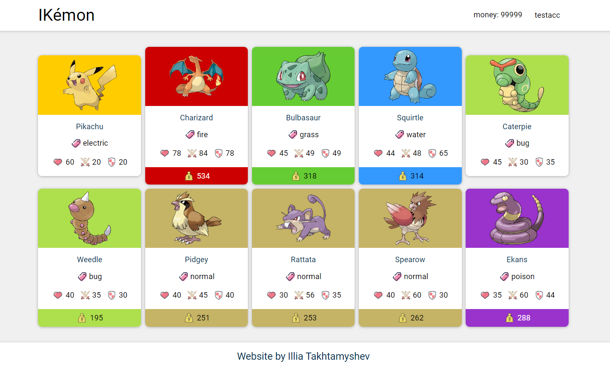
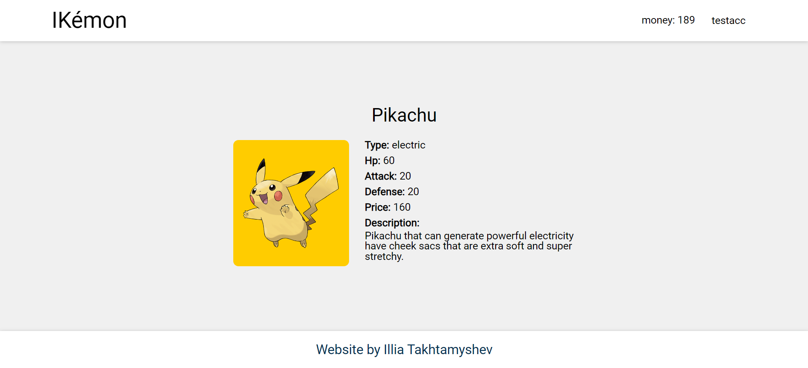
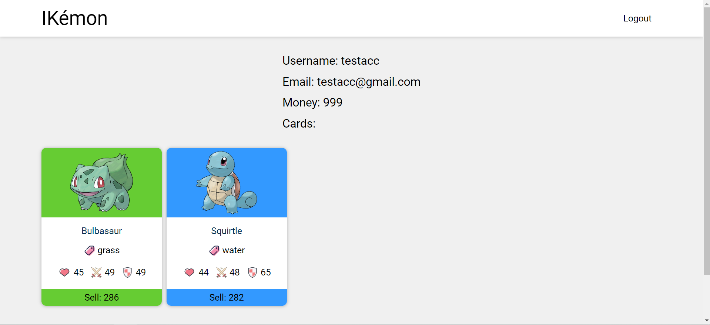
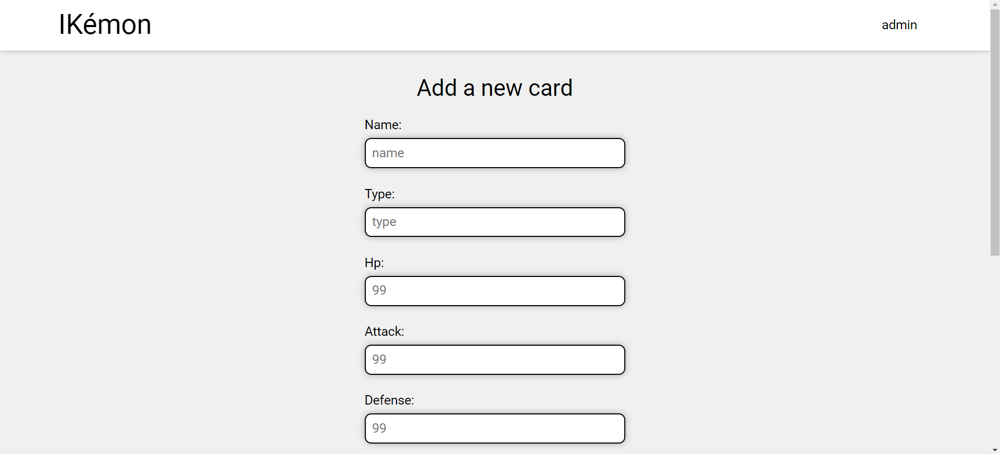

# IKemon
Pokémons have been released into our world! Naturally, NFT merchants quickly seized the opportunity and set about creating the most obvious way to trade, a website.
## Website was built using PHP.
### It has account system and buy-sell logic.
### Some information:
* you can register a new account or login into existing one
* after registration of a new account fixed amount of money is given to the user
* by clicking on Pokemon's name you can go to the details page
* you can buy cards after logging to an account
* account page can be opened by clicking on username after logging
* it is possible to sell cards with 90% from original cost from the account page
* there is an admin user who owns all cards which do not belong to anyone
* admin can create new cards through special form
* admin can not buy cards
* all users and cards are stored in json files

## Main page

## Card details page

## Account page

## New card adding page
